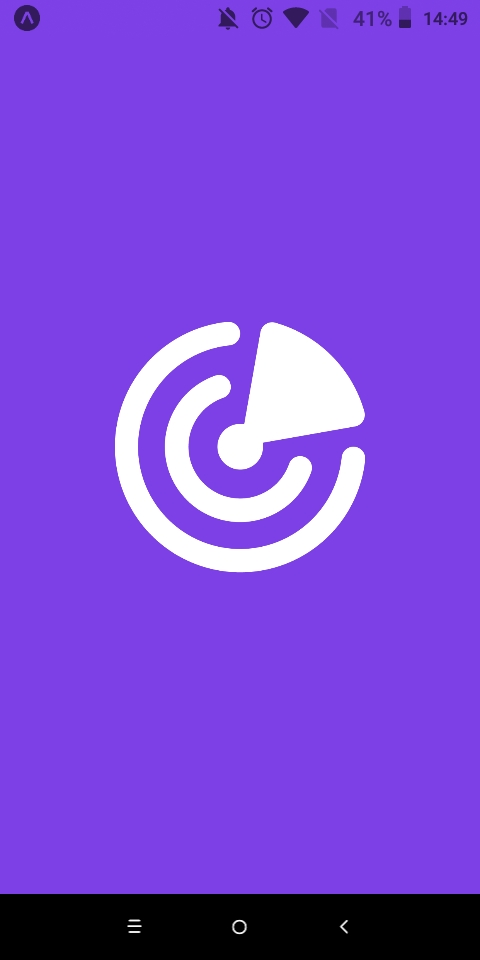
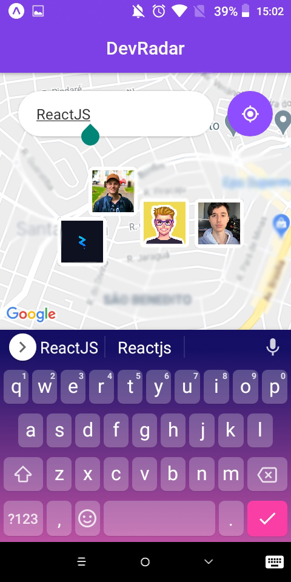
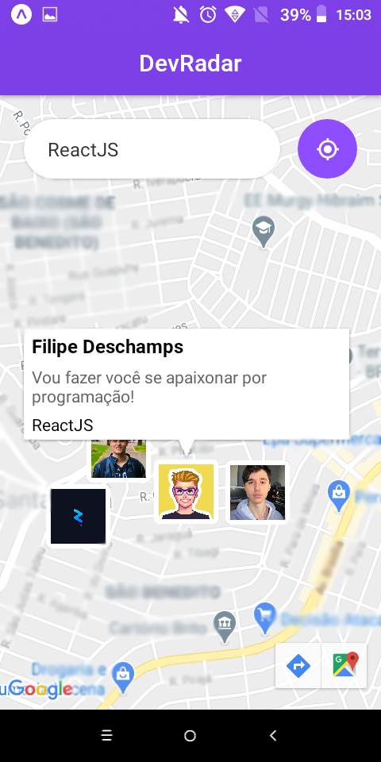

    
  
<b>Encontre devs ao seu alcance</b>

  

    <a href="#keyboard-resultado">Resultado</a>&nbsp;&nbsp;&nbsp;|&nbsp;&nbsp;&nbsp;
    <a href="#page_with_curl-sobre">Sobre</a>&nbsp;&nbsp;&nbsp;|&nbsp;&nbsp;&nbsp;
    <a href="#computer-tecnologias">Tecnologias</a>&nbsp;&nbsp;&nbsp;|&nbsp;&nbsp;&nbsp;
    <a href="#gear-requisitos">Requisitos</a>&nbsp;&nbsp;&nbsp;|&nbsp;&nbsp;&nbsp;
    <a href="#arrow_forward-como-utilizar">Como utilizar</a>&nbsp;&nbsp;&nbsp;|&nbsp;&nbsp;&nbsp;
    <a href="#recycle-como-contribuir">Como contribuir</a>&nbsp;&nbsp;&nbsp;|&nbsp;&nbsp;&nbsp;
    <a href="#wrench-creditos">Creditos</a>&nbsp;&nbsp;&nbsp;|&nbsp;&nbsp;&nbsp;
    <a href="#customs-license">Licença</a>
  

  
  
    
  

## :keyboard: Resultado

**Captura de tela da interface mobile**

Faça o download do **app para android** [clicando aqui]().

  
  
  
  

## :page_with_curl: Sobre

## :computer: Tecnologias

## :gear: Requisitos

## :arrow_forward: Como utilizar

## :recycle: Como Contribuir

- Faça um Fork deste repositório.
- Crie uma branch com a sua feature: `git checkout -b my-feature`
- Commit suas mudanças: `git commit -m 'feat: My new feature'`
- Push a sua branch: `git push origin my-feature`

## :wrench: Creditos
- [Rocketseat](https://www.youtube.com/rocketseat)
- [Diego Fernandes](https://github.com/diego3g)

## :customs: License

Esse projeto está sob a licença MIT. Veja o arquivo [LICENSE](https://github.com/zevdvlpr/dev-radar/tree/master/LICENSE) para mais detalhes.
