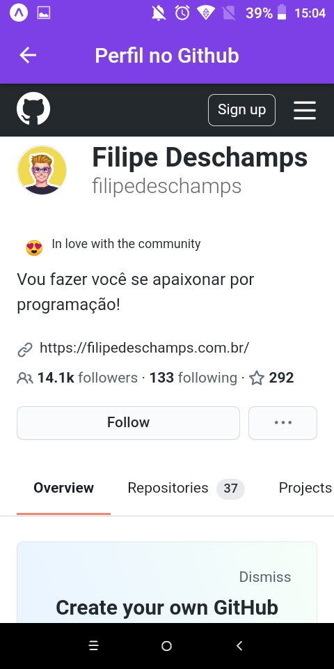

      
  <h1>DevRadar</h1>  
  
🛰️ Find developers at your fingertips.
    
  
    
  

      
      
                      
      
  
     
  

# About

DevRadar is a project that aims to connect developers close to you who work with the same technologies.

  
  
  
  

# Techs

 - [Expo](https://expo.io/)  
 - [React Native](https://reactnative.dev/)
 - [TypeScript](https://www.typescriptlang.org/)

# Requirements

- [Git](https://git-scm.com/) installed
- [Node](https://node.js.org/) installed
- Npm or [Yarn](https://yarnpkg.com/) installed

# Usage

- Clone this repository: `git clone https://github.com/zevdvlpr/dev-radar`.

**Server**

- Enter in directory: `cd server`.
- For install dependencies with `yarn install` or `npm install`.
- Rename the `.env.example` file to `.env`.
- Set the environment variables,
- Run the project with `yarn start` or `npm start`.

**Mobile**

- Enter in directory: `cd mobile`.
- Open a tab in your browser and navigate to: `http://localhost:19002`
- Once that's done, just download the expo client on your cell phone:
   - [Expo for Android](https://play.google.com/store/apps/details?id=host.exp.exponent&hl=pt_BR)
   - [Expo for IOS](https://apps.apple.com/br/app/expo-client/id982107779)
- Log into the app.
- Then just scan the QRCode.

# Contribute

- Fork the project.
- Create a new branch with your changes: `git checkout -b my-feature`.
- Save your changes and create a commit message telling you what you did: `git commit -m "feature: My new feature"`
- Submit your changes: `git push origin my-feature`.

# Authors

- [zevdvlpr](https://github.com/zevdvlpr)

# Credits 

- [Rocketseat](https://youtube.com/rocketseat)

 
 
 
 

  <h1>Open Source</h1>
  Copyright © 2020-present, zevdvlpr.
  
DevRadar <a href="https://github.com/zevdvlpr/dev-radar/tree/main/LICENSE">is MIT licensed 💖</a>

  

